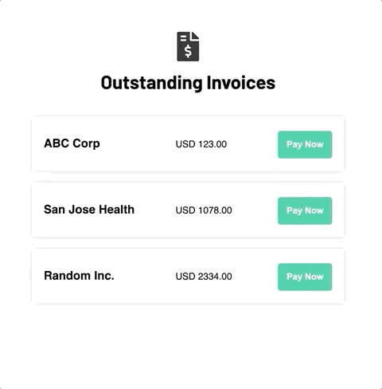

# Simple Payment App

## Overview

This is a simple payment application, where user sees a list of their outstanding invoices onn the landing page, and can choose to pay them with a credit card with the subsequent payment form.

The source code for the application are under `src/` with `index.js` being the entry point.

## How to Run

On terminal, `cd` into the top level of the directory and run:
```
npm install
npm start
```

## Demo

A gif that captures the main flow. Note that Chrome's autofill dropdown occassionally shows up. That is not an intended behavior.



## Points for Improvement:

- On the confirmation page, if a user clicks on "cancel", he or she will be redirected back to the payment page with a blank form. Ideally, the form should preserve what the user has entered previously.
- The credit card validations could be strengthen. Namely that validation rules for each credit card type (i.e. visa, master, discover, and amex) could be added to check for specific credit card number length and cvv length.
- Could set up linter for more readable code (i.e. single vs double quote, spacing).
- The hex code for colors could be stored in a global sass style sheet for components to import as variables.
- Could use typescript for strong type checking purpose. Omitted for the simplicity of the exercise.
